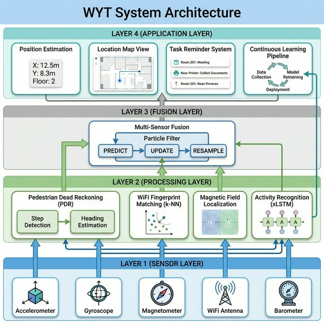
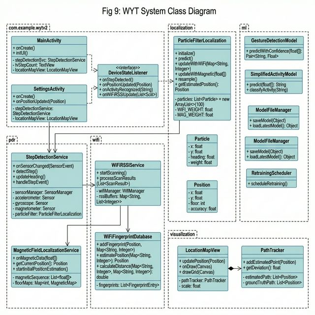
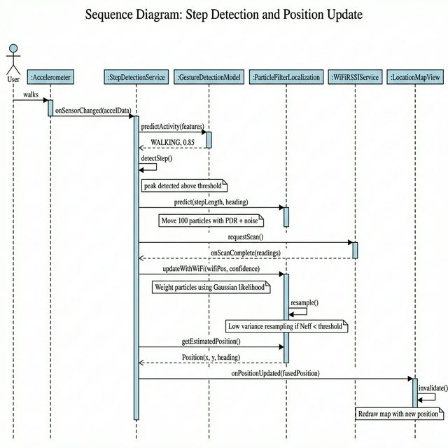
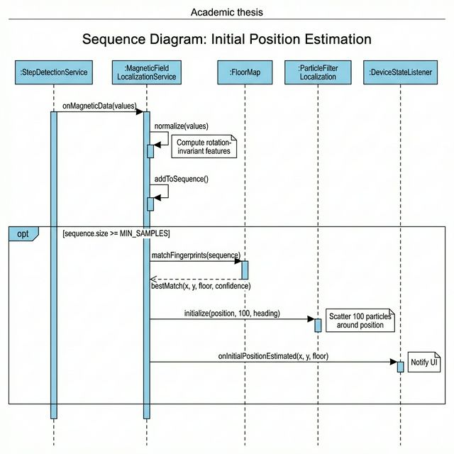
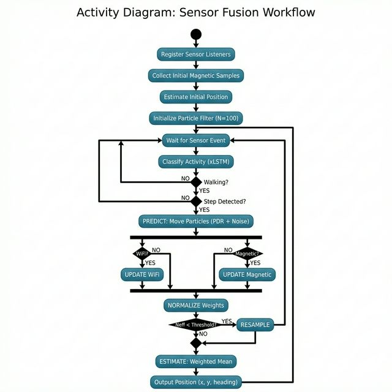
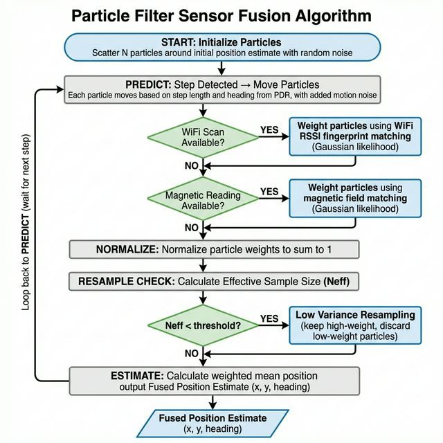
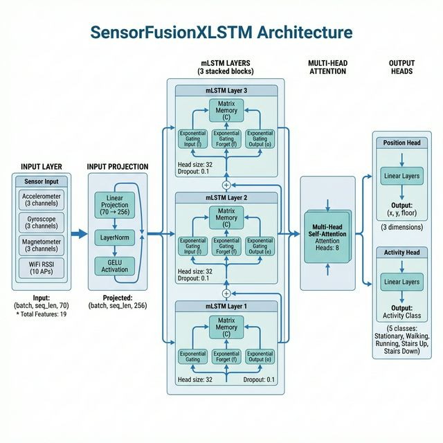

# CHAPTER 06: DESIGN

## 6.1 Chapter Overview

This chapter presents the detailed design of the WYT (When You're There) indoor localization and task reminder system. It translates the functional and non-functional requirements documented in the Software Requirement Specification (Chapter 4) into a concrete system architecture and component-level design. The chapter begins by defining the design goals that shape the system's quality attributes, followed by the high-level system architecture illustrating the layered structure of the prototype. Detailed design diagrams—including class diagrams, sequence diagrams, and activity diagrams—are then presented using the Object-Oriented Analysis and Design Methodology (OOADM). Subsequently, the algorithm design section articulates the core AI/ML pipeline, specifically the Particle Filter sensor fusion algorithm and the xLSTM neural network architecture. Finally, the user interface design is outlined through low-fidelity wireframe descriptions. Together, these elements provide a comprehensive blueprint from which the implementation (Chapter 7) directly follows.

## 6.2 Design Goals

The design goals for the WYT system are derived directly from the Non-Functional Requirements (NFRs) established in the SRS (Section 4.10). These quality attributes govern all architectural decisions and are maintained system-wide throughout the design and implementation phases.

**Table 21: Design Goals and NFR Mapping**

| Design Goal | NFR Reference | Design Strategy |
|---|---|---|
| **Accuracy** | NFR01 — ≤1.0 m mean error | Multi-sensor particle filter fusion combining PDR, WiFi RSSI fingerprinting, and magnetic field matching to achieve meter-level localisation accuracy (Sun et al., 2025; Lin and Yu, 2024). |
| **Infrastructure Independence** | NFR02 — No external fixed infrastructure | Exclusive reliance on built-in smartphone sensors (IMU, magnetometer, WiFi radio) and an offline fingerprint database, eliminating the need for beacons or UWB infrastructure (Leitch et al., 2023). |
| **Robustness** | NFR03 — Stable across movements and floors | Activity recognition module detects pedestrian state (walking, standing, sitting) to conditionally gate step detection, preventing false positives during stationary periods (Kim and Shin, 2025). |
| **Real-Time Performance** | NFR04 — Location update within 1–15 seconds | Sensor event listeners operate on the main thread with lightweight computation; the particle filter uses 100 particles to maintain sub-second processing latency per step event (Yang et al., 2024). |
| **Energy Efficiency** | NFR05 — Minimise battery drain | WiFi scanning occurs at configurable intervals (default 10 seconds) rather than continuously; sensor listeners are registered only for required sensors; the particle filter avoids matrix inversions typical of Kalman filters (Wu et al., 2024). |
| **Scalability** | NFR06 — Generalise to unseen environments | The fingerprint database design allows new environments to be added through a calibration phase without retraining the core PDR algorithm; the xLSTM model is trained on public datasets (UJIIndoorLoc, Opportunity) to promote generalisation (Wang, He and Cui, 2025). |
| **Privacy** | NFR07 — All processing on-device | All sensor data processing, model inference, and position estimation occur entirely on the user's smartphone. No data is transmitted to external servers, achieving edge-computing privacy compliance (Fahama et al., 2025). |

## 6.3 System Architecture Diagram

The WYT system follows a four-tiered layered architecture, where each tier encapsulates a distinct responsibility and communicates with adjacent layers through well-defined interfaces. This separation of concerns facilitates independent development, testing, and future enhancement of individual components.

**Fig 8: WYT System Architecture**



The four architectural layers are described below:

### Layer 1: Sensor Layer

The bottom layer interfaces directly with the smartphone's hardware sensors via the Android `SensorManager` API. The following sensors are utilised:

- **Accelerometer** — Provides tri-axial linear acceleration data (m/s²), used for step detection and activity recognition.
- **Gyroscope** — Measures angular velocity (rad/s) around three axes, used for heading estimation and orientation tracking.
- **Magnetometer** — Reports the ambient magnetic field vector (μT), used for drift correction through magnetic fingerprint matching.
- **WiFi Radio** — Scans for nearby access points and measures Received Signal Strength Indication (RSSI) values, used for fingerprint-based position estimation.
- **Barometer** — Measures atmospheric pressure (hPa), used for floor-level detection.

### Layer 2: Processing Layer

This layer contains four independent processing modules, each responsible for extracting position-relevant information from raw sensor data:

1. **Pedestrian Dead Reckoning (PDR)** — Processes accelerometer and gyroscope data to detect steps (using peak detection with adaptive thresholding) and estimate heading changes (through gyroscope integration). Each detected step produces a displacement vector consisting of a step length (calibrated per user) and a heading angle (Deng et al., 2018).

2. **WiFi Fingerprint Matching (k-NN)** — Compares current WiFi RSSI readings against a pre-collected fingerprint database using Weighted k-Nearest Neighbour (WKNN) matching. Euclidean distance in RSSI space is computed for each stored fingerprint, and the k nearest matches are combined through inverse-distance weighting to produce a position estimate (Fahama et al., 2025).

3. **Magnetic Field Localisation** — Matches current magnetometer readings against a database of magnetic fingerprints collected during a calibration phase. The magnetic field is normalised to be rotation-invariant, and the closest fingerprint provides a position estimate or calibration correction (Sun et al., 2025).

4. **Activity Recognition (xLSTM)** — A deep learning model based on the Extended Long Short-Term Memory (xLSTM) architecture processes sequences of IMU features to classify the user's current activity (walking, standing, sitting, hand gestures, typing). This classification gates the step detection module: steps are only counted when the model predicts walking activity, thus reducing false positives (Wang, He and Cui, 2025).

### Layer 3: Fusion Layer

The fusion layer implements a **Particle Filter** — a Sequential Monte Carlo method — to probabilistically combine the outputs of all processing modules into a single, robust position estimate. The particle filter operates through three iterative steps (Yang et al., 2024):

1. **Predict** — When a step is detected, all particles are propagated forward using the PDR displacement vector with added Gaussian motion noise.
2. **Update** — Particle weights are updated using Gaussian likelihood functions when WiFi or magnetic measurements become available.
3. **Resample** — When the Effective Sample Size (Neff) falls below a threshold, low-variance resampling is performed to concentrate particles in likely regions.

This probabilistic framework naturally handles the asynchronous arrival rates of different sensor modalities and provides graceful degradation when individual sensors are temporarily unavailable.

### Layer 4: Application Layer

The top layer provides the user-facing functionality:

- **Position Estimation** — Delivers the weighted mean of particle positions as the fused 2D position estimate (x, y) with heading.
- **Location Map View** — A custom Android `View` that renders the estimated trajectory, ground truth path, and deviation indicators on an interactive grid map with pinch-to-zoom and pan controls.
- **Task Reminder System** — Monitors the user's estimated position and triggers notifications when the user enters predefined geofence zones associated with location-based reminders (FR05).
- **Continuous Learning Pipeline** — Collects step detection data during normal usage; a background scheduler periodically retrains the activity recognition model using accumulated data, enabling the system to adapt to the individual user's gait characteristics over time.

## 6.4 Detailed Design

This section presents the detailed design of the WYT system using the Object-Oriented Analysis and Design Methodology (OOADM). The following UML diagrams are provided: a class diagram showing the static structure, sequence diagrams illustrating key interactions, and an activity diagram depicting the sensor fusion workflow.

### 6.4.1 Class Diagram

The class diagram below illustrates the core classes in the WYT system and their relationships. The system is organised into five packages: `pdr`, `wifi`, `localization`, `ml`, and `visualization`.

**Fig 9: WYT System Class Diagram**



**Key Relationships:**

- `MainActivity` and `SettingsActivity` both implement the `DeviceStateListener` interface to receive real-time updates from `StepDetectionService`.
- `StepDetectionService` acts as the central coordinator, aggregating data from `WiFiRSSIService`, `MagneticFieldLocalizationService`, and the activity recognition models (`GestureDetectionModel`, `SimplifiedActivityModel`), then feeding the fused result into `ParticleFilterLocalization`.
- The `ml` package follows a pipeline pattern: `StepDataCollector` → `StepDataDatabase` → `ModelRetrainer` → `ModelFileManager`, orchestrated by `RetrainingScheduler`.
- `LocationMapView` uses composition to delegate path data management to `PathTracker`.

### 6.4.2 Sequence Diagram: Step Detection and Position Update

The following sequence diagram illustrates the interaction between components when a user takes a step and the system produces a position update.



### 6.4.3 Sequence Diagram: Initial Position Estimation

This sequence diagram shows how the system determines the user's starting position using magnetic field matching during the initialisation phase.



### 6.4.4 Activity Diagram: Sensor Fusion Workflow

The activity diagram below depicts the overall sensor fusion workflow from sensor data acquisition to position output.



## 6.5 Algorithm Design

This section details the two core AI/ML components of the WYT system: the Particle Filter for multi-sensor fusion and the xLSTM neural network for activity recognition and positioning.

### 6.5.1 Particle Filter Algorithm

The Particle Filter (PF), also known as a Sequential Monte Carlo method, is employed as the central fusion algorithm. Unlike the Extended Kalman Filter (EKF) or Unscented Kalman Filter (UKF), the PF makes no assumptions about the linearity of the system model or the Gaussianity of noise distributions, making it well-suited for the multi-modal sensor fusion problem in indoor localization (Yang et al., 2024; Sun et al., 2025).

**Fig 10: Particle Filter Sensor Fusion Flowchart**



**Algorithm 1: Particle Filter Sensor Fusion**

```
ALGORITHM: ParticleFilterFusion

INPUT: Initial position P₀, Number of particles N, Sensor streams S
OUTPUT: Fused position estimate at each time step

1.  INITIALISE:
    FOR i = 1 TO N:
        particle[i].x ← P₀.x + Gaussian(0, σ_init)
        particle[i].y ← P₀.y + Gaussian(0, σ_init)
        particle[i].heading ← initialHeading + Gaussian(0, σ_heading)
        particle[i].weight ← 1/N

2.  LOOP (on each step detection event):

    // PREDICTION STEP
    FOR i = 1 TO N:
        particle[i].heading ← particle[i].heading + Δheading + Gaussian(0, σ_h)
        particle[i].x ← particle[i].x + stepLength × cos(particle[i].heading) + Gaussian(0, σ_x)
        particle[i].y ← particle[i].y + stepLength × sin(particle[i].heading) + Gaussian(0, σ_y)

    // UPDATE STEP (WiFi)
    IF WiFi scan is available THEN:
        wifiPos ← kNN_WiFi_Estimate(currentScan, fingerprintDB, k=3)
        FOR i = 1 TO N:
            d ← EuclideanDistance(particle[i], wifiPos)
            likelihood ← exp(-d² / (2 × σ_wifi²))
            particle[i].weight ← particle[i].weight × (1 + w_wifi × likelihood)

    // UPDATE STEP (Magnetic)
    IF Magnetic reading is available THEN:
        magPos ← MagneticFingerprint_Match(currentMagnetic, magDB)
        FOR i = 1 TO N:
            d ← EuclideanDistance(particle[i], magPos)
            likelihood ← exp(-d² / (2 × σ_mag²))
            particle[i].weight ← particle[i].weight × (1 + w_mag × likelihood)

    // NORMALISE
    totalWeight ← SUM(particle[i].weight for all i)
    FOR i = 1 TO N:
        particle[i].weight ← particle[i].weight / totalWeight

    // RESAMPLE (if effective sample size is low)
    Neff ← 1 / SUM(particle[i].weight² for all i)
    IF Neff < RESAMPLE_THRESHOLD × N THEN:
        LowVarianceResample(particles)

    // ESTIMATE
    x_est ← SUM(particle[i].x × particle[i].weight)
    y_est ← SUM(particle[i].y × particle[i].weight)
    heading_est ← CircularMean(particle[i].heading, particle[i].weight)
    RETURN Position(x_est, y_est, heading_est)
```

**Key Parameters:**

| Parameter | Value | Purpose |
|---|---|---|
| N (particles) | 100 | Balances accuracy with real-time performance on mobile |
| σ_init | 2.0 m | Initial position uncertainty |
| σ_x, σ_y | 0.3 m | Motion noise per step |
| σ_heading | 0.15 rad | Heading noise per step |
| σ_wifi | 3.0 m | WiFi measurement noise |
| σ_mag | 2.0 m | Magnetic measurement noise |
| w_wifi | 5.0 | WiFi correction weight |
| w_mag | 3.0 | Magnetic correction weight |
| Resample threshold | 0.5 | Triggers when Neff < 50% of N |

### 6.5.2 xLSTM Neural Network Architecture

The Extended Long Short-Term Memory (xLSTM) model is based on the mLSTM (matrix memory LSTM) variant proposed by Beck et al. (2024). Unlike standard LSTM cells that use scalar memory, the mLSTM cell employs a matrix-valued memory state and exponential gating, which improves gradient flow and enables the model to capture longer temporal dependencies in sensor data sequences (Wang, He and Cui, 2025).

**Fig 11: SensorFusionXLSTM Architecture**



The model architecture consists of the following components:

1. **Input Projection Layer**: A linear transformation maps the 70-dimensional sensor feature vector (comprising 6 IMU channels, 3 magnetometer channels, and features derived from up to 10 WiFi access points, plus statistical features) to a 256-dimensional hidden representation, followed by LayerNorm and GELU activation.

2. **mLSTM Stack (3 layers)**: Three mLSTM layers with residual connections process the projected sequence. Each mLSTM cell uses:
   - Exponential gating for input (i), forget (f), and output (o) gates
   - Matrix memory state C ∈ ℝ^(d_head × d_head) instead of scalar memory
   - Head size of 32 with 8 attention heads
   - Dropout rate of 0.1 for regularisation

3. **Multi-Head Self-Attention**: An 8-head attention mechanism processes the mLSTM output to capture global temporal relationships across the sequence.

4. **Dual Output Heads**:
   - **Position Head**: Two linear layers with ReLU activation predict the 3D position vector (x, y, floor).
   - **Activity Head**: Two linear layers with ReLU activation followed by softmax predict the activity class distribution over 5 classes (Stationary, Walking, Running, Stairs Up, Stairs Down).

**Training Configuration:**

| Hyperparameter | Value |
|---|---|
| Feature dimension | 70 |
| Hidden size | 256 |
| Number of mLSTM layers | 3 |
| Head size | 32 |
| Attention heads | 8 |
| Dropout | 0.1 |
| Batch size | 32 |
| Learning rate | 0.001 |
| Weight decay | 1×10⁻⁵ |
| Sequence length | 50 (≈1 second at 50 Hz) |
| Position loss weight | 0.5 |
| Activity loss weight | 1.5 |
| Gradient clipping | 1.0 |

The model was trained using the Opportunity dataset for activity recognition and the UJIIndoorLoc dataset for WiFi positioning, with the training pipeline implemented in PyTorch (see Chapter 7 for implementation details).

## 6.6 UI Design

The WYT application consists of four primary screens, each designed to support a specific phase of the user's interaction with the system. Low-fidelity wireframe descriptions are provided below. Actual implemented UI screenshots are included in Chapter 7 (Implementation).

### 6.6.1 Main Activity Screen

The main screen serves as the primary control panel for the localization system. It is divided into four functional panels:

- **Step Counter Panel** (top-left): Displays the current session step count, total step count, and step length in real time. A large numeric display ensures visibility during testing.
- **Threshold Control Panel** (top-right): Provides a SeekBar slider for adjusting the step detection sensitivity threshold (range 0.0–5.0). The current threshold value is displayed alongside an "Apply" button.
- **Status Panel** (middle): Shows the device state (stationary/moving), current heading (degrees), and activity recognition result with emoji indicator and confidence percentage.
- **WiFi RSSI Panel** (bottom): Lists detected WiFi access points with their BSSIDs and RSSI values, along with the overall RSSI variance — useful for verifying WiFi data quality during calibration.

**Design Considerations (Usability):** All panels follow a card-based layout with clear titles and sufficient padding to prevent information overload. Font sizes are large enough for at-a-glance reading during physical walking tests.

### 6.6.2 Settings / Map Activity Screen

The settings screen provides the real-time map visualisation and advanced controls:

- **Location Map View** (main area): A custom-drawn interactive map showing:
  - A coordinate grid with 1-meter spacing and axis labels
  - The estimated path as a coloured polyline (green→red gradient indicating recency)
  - Ground truth markers (cyan dots) for accuracy verification
  - Deviation lines connecting estimated positions to ground truth points
  - The current position as a filled circle with heading indicator
  - A legend explaining the colour coding
- **Map Controls**: Buttons for clearing the path, setting trigger points, toggling auto-centre mode, and adjusting zoom level.
- **Step Count Display**: A large panel showing the current step count, ensuring continuity with the main screen.

**Design Considerations (Accessibility):** The map uses high-contrast colours (green, cyan, red, white) against a dark background to accommodate users with mild colour vision deficiencies. Touch gestures (pinch-to-zoom, drag-to-pan) follow standard Android conventions.

### 6.6.3 Calibration Activity Screen

The calibration screen guides the user through collecting fingerprint data:

- **Position Input**: Numeric fields for entering the known (x, y) coordinates and floor number of the current calibration point.
- **Sensor Readings**: Real-time display of current accelerometer, magnetometer, and WiFi readings.
- **Calibration Control**: A "Calibrate" button that triggers data collection; a progress indicator shows the number of samples collected.
- **Status Feedback**: Text area displaying calibration progress and confirmation messages.

### 6.6.4 Graph / Debug Activity Screen

The debug screen provides raw sensor data visualisation for development and testing:

- **Accelerometer Graph**: Real-time line plot of tri-axial acceleration data.
- **Step Detection Visualisation**: Overlay showing peak detection events on the accelerometer magnitude signal.

## 6.7 Chapter Summary

This chapter presented the comprehensive design of the WYT indoor localization system. The design goals were mapped directly from the Non-Functional Requirements established in the SRS (Chapter 4), ensuring traceability between requirements and design decisions. The four-layered system architecture — comprising Sensor, Processing, Fusion, and Application layers — provides a clear separation of concerns that facilitates independent development and testing of each component.

The detailed OOAD design revealed the object-oriented structure of the system, with `StepDetectionService` acting as the central coordinator that aggregates sensor data through the `MagneticFieldLocalizationService` and `WiFiRSSIService`, fuses results via `ParticleFilterLocalization`, and distributes updates through the `DeviceStateListener` interface to multiple UI activities.

The algorithm design section presented two core AI/ML components: the Particle Filter, which probabilistically fuses PDR, WiFi, and magnetic measurements without assuming linearity or Gaussianity; and the SensorFusionXLSTM architecture, which leverages matrix memory and exponential gating for temporal sensor data processing. Finally, the UI design provided wireframe-level descriptions of the four application screens, with emphasis on usability and accessibility considerations.

The following chapter (Chapter 7) details how this design was translated into a functional prototype, covering technology selection, implementation specifics, and challenges encountered during development.

---

## References (Chapter 6)

Beck, M. et al. (2024) 'xLSTM: Extended Long Short-Term Memory'. *arXiv preprint arXiv:2405.04517*.

Deng, Z. et al. (2018) 'Robust heading estimation for indoor pedestrian navigation using unconstrained smartphones', *Wireless Communications and Mobile Computing*, 2018(1). doi:10.1155/2018/5607036.

Fahama, H.S. et al. (2025) 'Indoor localization using RSSI based supervised machine learning approaches', *2025 Fifth National and the First International Conference on Applied Research in Electrical Engineering (AREE)*, pp. 1–6. doi:10.1109/aree63378.2025.10880244.

Kim, J.-W. and Shin, Y. (2025) 'Deep learning-based multi-floor indoor localization using smartphone IMU sensors with 3D location initialization', *IEEE Access*, 13, pp. 101532–101544. doi:10.1109/access.2025.3578354.

Leitch, S. et al. (2023) 'On indoor localization using WiFi, BLE, UWB, and IMU Technologies', *Sensors*, 23(20), p. 8598. doi:10.3390/s23208598.

Lin, Y. and Yu, K. (2024) 'An improved integrated indoor positioning algorithm based on PDR and Wi-Fi under map constraints', *IEEE Sensors Journal*, 24(15), pp. 24096–24107. doi:10.1109/jsen.2024.3408249.

Sun, M. et al. (2025) 'Smartphone-based indoor localization system using Wi-Fi RTT/magnetic/PDR based on an improved particle filter', *IEEE Transactions on Instrumentation and Measurement*, 74, pp. 1–16. doi:10.1109/tim.2025.3547501.

Wang, H., He, J. and Cui, L. (2025) 'An advanced indoor localization method based on xLSTM and residual multimodal fusion of UWB/IMU data', *Electronics*, 14(13), p. 2730. doi:10.3390/electronics14132730.

Wu, L. et al. (2024) 'Indoor positioning method for pedestrian dead reckoning based on multi-source sensors', *Measurement*, 229, p. 114416. doi:10.1016/j.measurement.2024.114416.

Yang, X. et al. (2024) 'Multi-sensor fusion and semantic map-based particle filtering for robust indoor localization', *Measurement*, 242, p. 115874. doi:10.1016/j.measurement.2024.115874.
