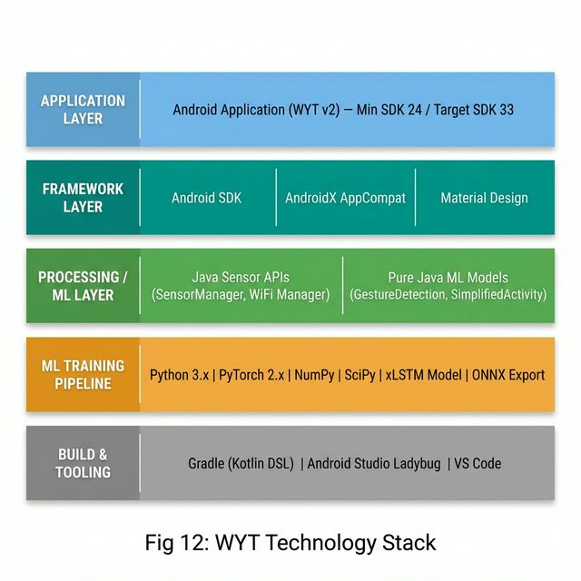

# CHAPTER 07: IMPLEMENTATION

## 7.1 Chapter Overview

This chapter documents the implementation phase of the WYT (When You're There) indoor localization system, translating the designs presented in Chapter 6 into a fully functional Android prototype. The chapter begins with a justification of the technology selections made for both the mobile application and the machine learning pipeline. It then provides a detailed walkthrough of the core functionalities, describing how each module — Pedestrian Dead Reckoning (PDR), WiFi fingerprint matching, magnetic field localization, particle filter fusion, and the continuous learning pipeline — was developed and integrated. The user interface implementation is subsequently presented with descriptions of the actual screens and their integration with the backend sensor services. Finally, the key challenges encountered during development and the solutions devised to address them are discussed. This chapter establishes the readiness of the system for the testing and evaluation phase.

## 7.2 Technology Selection

The technologies used in this project were selected based on their suitability for real-time sensor processing on mobile devices, support for machine learning model training and deployment, and alignment with the system requirements specified in Chapter 4.

### 7.2.1 Technology Stack

**Fig 12: WYT Technology Stack**



### 7.2.2 Programming Languages

**Java (Android Application):** Java was selected as the primary language for the Android application because of its mature ecosystem for Android development, strong typing for safety-critical sensor processing, and extensive documentation. All sensor event handling, particle filter computation, and UI rendering are implemented in Java. The project targets Java 11 (source and target compatibility), ensuring modern language features while maintaining broad device compatibility.

**Python (ML Training Pipeline):** Python was used for the offline machine learning training pipeline due to its dominant position in the data science ecosystem and the availability of PyTorch for deep learning model development. The training scripts process the Opportunity and UJIIndoorLoc datasets, train the xLSTM-based sensor fusion model, and export it for mobile deployment.

**Kotlin (Build Configuration):** The Gradle build system uses the Kotlin DSL (`build.gradle.kts`) for project configuration, as recommended by modern Android development conventions.

### 7.2.3 Development Framework

**Android SDK (API 24–33):** The application targets a minimum SDK of 24 (Android 7.0 Nougat) to ensure access to the full `SensorManager` API, WiFi scanning capabilities, and background service support. The target SDK is set to 33 to avoid 16KB page size enforcement while remaining compatible with recent Android versions. The application uses `AndroidX AppCompat` for backward-compatible UI components and `Material Design` for consistent visual styling (Liu et al., 2025).

**PyTorch (ML Training):** The xLSTM model was trained using PyTorch 2.x, leveraging its dynamic computation graph for flexible model experimentation. PyTorch was chosen over TensorFlow due to its more Pythonic API and better support for custom recurrent cell implementations (such as the mLSTM cell with matrix memory) (Wang, He and Cui, 2025).

### 7.2.4 Libraries / Toolkits

| Library | Version | Purpose |
|---|---|---|
| `androidx.core:core-ktx` | Latest | Kotlin extensions for Android framework APIs |
| `androidx.appcompat:appcompat` | Latest | Backward-compatible Activity and View classes |
| `com.google.android.material` | Latest | Material Design UI components |
| `junit` | 4.x | Unit testing framework |
| `androidx.test.ext:junit` | Latest | Android instrumentation test support |
| `androidx.test.espresso:espresso-core` | Latest | UI testing framework |
| `torch` (Python) | 2.x | Deep learning model training |
| `numpy` | 1.x | Numerical computation for data preprocessing |
| `scipy` | 1.x | Signal processing and statistical functions |
| `PyYAML` | 6.x | Training configuration parsing |

Note that PyTorch Mobile (`org.pytorch:pytorch_android`) was initially considered for on-device model inference but was subsequently replaced with a pure Java implementation (`GestureDetectionModel.java`) to eliminate the 40 MB+ native library dependency and reduce APK size, in line with the energy efficiency requirement (NFR05).

### 7.2.5 Integrated Development Environment (IDEs)

**Android Studio Ladybug (2024.2):** The primary IDE used for all Android development, providing integrated Gradle build support, visual layout editing, ADB debugging, and Logcat monitoring for real-time sensor data inspection during testing.

**Visual Studio Code:** Used for the Python ML training pipeline, with extensions for Python linting, YAML configuration editing, and Jupyter notebook support for exploratory data analysis.

### 7.2.6 Summary of the Technology Selection

The technology stack was designed to maximise on-device performance while minimising external dependencies. The decision to replace PyTorch Mobile with a pure Java model implementation is a key architectural choice that reduced APK size by over 40 MB and eliminated JNI overhead, directly supporting NFR05 (Energy Efficiency) and NFR02 (Infrastructure Independence). The use of Python for offline training allows leveraging the full PyTorch ecosystem during development without burdening the runtime environment.

## 7.3 Core Functionalities Implementation

This section details the implementation of each major module, relating them to the functional requirements (FRs) defined in the SRS (Chapter 4) and the design components described in Chapter 6.

### 7.3.1 Pedestrian Dead Reckoning Module (FR01, FR02)

The PDR module is implemented within `StepDetectionService.java` (1,455 lines), which extends Android's `Service` class and implements `SensorEventListener` to receive sensor events from the accelerometer, gyroscope, and magnetometer at `SensorManager.SENSOR_DELAY_GAME` rate (approximately 50 Hz).

**Step Detection Algorithm:**

Step detection uses peak detection on the accelerometer magnitude signal with an adaptive binary threshold:

```java
// StepDetectionService.java - Step Detection Core Logic
private void detectStep(float magnitude) {
    if (magnitude > binaryThreshold && !stepInProgress) {
        stepInProgress = true;
        long now = System.currentTimeMillis();
        if (now - lastStepTime > MIN_STEP_INTERVAL) {
            sessionStepCount++;
            totalStepCount++;
            lastStepTime = now;
            handleStepEvent();
        }
    } else if (magnitude < binaryThreshold * 0.7f) {
        stepInProgress = false;
    }
}
```

The threshold value is user-configurable via a SeekBar in the main UI (range 0.0–5.0, default 1.0) and is also adaptively refined by the continuous learning pipeline. The `MIN_STEP_INTERVAL` constant (300 ms) prevents double-counting from noisy accelerometer spikes (Wu et al., 2024).

**Heading Estimation:**

Heading is computed by integrating gyroscope angular velocity around the vertical (z) axis:

```java
// StepDetectionService.java - Heading Integration
private void updateHeading(float[] gyroValues, long timestamp) {
    if (lastGyroTimestamp > 0) {
        float dt = (timestamp - lastGyroTimestamp) / 1_000_000_000.0f;
        if (dt > 0 && dt < 1.0f) {
            currentHeading += gyroValues[2] * dt; // Integrate yaw rate
            currentHeading = normalizeAngle(currentHeading);
        }
    }
    lastGyroTimestamp = timestamp;
}
```

The use of `System.nanoTime()` for delta-T computation was implemented after discovering that `SensorEvent.timestamp` could produce identical values on certain devices, resulting in zero deltas and preventing heading updates — a key debugging effort documented in Section 7.5 (Deng et al., 2018).

**Step Length Estimation:**

The step length is estimated using the Weinberg model, where the step length is proportional to the fourth root of the difference between maximum and minimum vertical acceleration during a step cycle. A default value of 0.7 metres is used when insufficient data is available for the Weinberg calculation (Lin and Yu, 2024).

### 7.3.2 WiFi Fingerprint Matching Module (FR04)

The WiFi positioning module consists of two classes:

**`WiFiRSSIService.java` (288 lines):** Manages periodic WiFi scanning using the Android `WifiManager` API. Scans are triggered at configurable intervals (default: every 10 seconds) through a `Handler` mechanism. Scan results are processed to extract per-AP RSSI values, compute RSSI variance for stability detection, and deliver readings to registered listeners.

```java
// WiFiRSSIService.java - Scan Processing
private void processScanResults() {
    List<ScanResult> results = wifiManager.getScanResults();
    List<WiFiReading> readings = new ArrayList<>();
    for (ScanResult result : results) {
        readings.add(new WiFiReading(result.BSSID, result.level));
        // Update rolling RSSI buffer for variance calculation
        updateBuffer(result.BSSID, result.level);
    }
    float variance = calculateOverallVariance();
    if (listener != null) {
        listener.onRSSIUpdate(readings, variance);
        listener.onScanComplete(readings);
    }
}
```

**`WiFiFingerprintDatabase.java` (200 lines):** Implements the Weighted k-Nearest Neighbour (WKNN) fingerprint matching algorithm. Given a set of current WiFi readings, the database computes the Euclidean distance in RSSI space to each stored fingerprint and returns a weighted average position of the k= 3 nearest matches:

```java
// WiFiFingerprintDatabase.java - k-NN Position Estimation
public Position estimatePosition(List<WiFiReading> currentScan, int k) {
    List<FingerprintDistance> distances = new ArrayList<>();
    for (Fingerprint fp : fingerprints) {
        float distance = calculateDistance(currentScan, fp.readings);
        distances.add(new FingerprintDistance(fp, distance));
    }
    distances.sort((a, b) -> Float.compare(a.distance, b.distance));

    int numNeighbors = Math.min(k, distances.size());
    float totalWeight = 0, weightedX = 0, weightedY = 0;
    for (int i = 0; i < numNeighbors; i++) {
        float weight = 1.0f / (1.0f + distances.get(i).distance);
        totalWeight += weight;
        weightedX += distances.get(i).fingerprint.x * weight;
        weightedY += distances.get(i).fingerprint.y * weight;
    }
    return new Position(weightedX/totalWeight, weightedY/totalWeight, ...);
}
```

The RSSI distance function computes over common BSSIDs between the current scan and each fingerprint, returning `Float.MAX_VALUE` when no common access points exist — effectively excluding non-overlapping fingerprints from consideration (Fahama et al., 2025; Csik, Odry and Sarcevic, 2023).

### 7.3.3 Magnetic Field Localization Module (FR04, FR06)

The `MagneticFieldLocalizationService.java` (394 lines) performs two key functions:

1. **Initial Position Estimation (FR06):** During startup, the service collects a sequence of magnetometer readings, normalises them to produce rotation-invariant feature vectors, and matches the sequence against a pre-loaded magnetic fingerprint database. The best-matching fingerprint position is used to initialise the particle filter, enabling the system to determine its starting location without user input.

2. **Continuous Drift Correction (FR04):** During normal operation, each new magnetometer reading is compared against the fingerprint database, and the resulting position estimate is fed into the particle filter as an update step, providing periodic corrections to counteract PDR drift.

The magnetic field vector is normalised to extract the magnitude and inclination angle, making the features invariant to the phone's orientation:

```java
// MagneticFieldLocalizationService.java - Normalisation
private float[] normalizeMagneticVector(float[] magneticVector) {
    float magnitude = calculateMagneticMagnitude(magneticVector);
    if (magnitude < 1.0f) return null;
    return new float[]{
        magneticVector[0] / magnitude,
        magneticVector[1] / magnitude,
        magneticVector[2] / magnitude,
        magnitude
    };
}
```

Fingerprints are organised by floor in `FloorMap` objects with attached `CalibrationNode` lists, allowing the system to handle multi-floor indoor environments (Sun et al., 2025; Kim and Shin, 2025).

### 7.3.4 Particle Filter Fusion Module (FR01, FR04)

The `ParticleFilterLocalization.java` (441 lines) implements the Sequential Monte Carlo fusion algorithm described in Algorithm 1 (Chapter 6, Section 6.5.1).

**Prediction Step:**

```java
// ParticleFilterLocalization.java - Particle Prediction
public void predict(float stepLength, float heading) {
    for (Particle p : particles) {
        float noisyHeading = p.heading + heading
            + gaussian(0, MOTION_NOISE_HEADING);
        p.x += stepLength * (float) Math.cos(noisyHeading)
            + gaussian(0, MOTION_NOISE_X);
        p.y += stepLength * (float) Math.sin(noisyHeading)
            + gaussian(0, MOTION_NOISE_Y);
        p.heading = noisyHeading;
    }
}
```

**Update Step (Gaussian Likelihood):**

```java
// ParticleFilterLocalization.java - Weight Update
private void updateWeights(Position measurement, float noise, float weight) {
    for (Particle p : particles) {
        float dx = p.x - measurement.x;
        float dy = p.y - measurement.y;
        float distance = (float) Math.sqrt(dx * dx + dy * dy);
        float likelihood = (float) Math.exp(
            -(distance * distance) / (2 * noise * noise));
        p.weight *= (1.0f + weight * likelihood);
    }
    normalizeWeights();
}
```

**Low Variance Resampling:**

The resampling algorithm uses the systematic/low-variance approach, which is more computationally efficient than multinomial resampling and produces less variance in the resampled set (Yang et al., 2024):

```java
// ParticleFilterLocalization.java - Low Variance Resampling
private void resample() {
    float neff = calculateEffectiveSampleSize();
    if (neff > RESAMPLE_THRESHOLD * particles.size()) return;

    List<Particle> newParticles = new ArrayList<>();
    float r = random.nextFloat() / particles.size();
    float c = particles.get(0).weight;
    int i = 0;
    for (int j = 0; j < particles.size(); j++) {
        float u = r + (float) j / particles.size();
        while (u > c && i < particles.size() - 1) {
            i++;
            c += particles.get(i).weight;
        }
        newParticles.add(new Particle(
            particles.get(i).x, particles.get(i).y,
            particles.get(i).heading, 1.0f / particles.size()));
    }
    particles = newParticles;
}
```

The filter uses 100 particles, which was empirically determined to provide a good balance between localisation accuracy and computational performance on mid-range Android devices.

### 7.3.5 Activity Recognition Module (FR02)

Activity recognition is implemented through two complementary models:

**`GestureDetectionModel.java` (174 lines):** A 5-class gesture detection model exported from the xLSTM training pipeline. The model classifies input sensor feature windows into: Walking (class 0), Standing (class 1), Sitting (class 2), Hand Gestures (class 3), and Typing/Fine Motor (class 4). The model was trained on the Opportunity dataset and achieves 77.73% validation accuracy. The model weights are embedded directly in Java as flattened arrays to avoid file I/O overhead.

```java
// GestureDetectionModel.java - Inference
public PredictionResult predictWithConfidence(float[] features) {
    float[] logits = computeLayerOutputs(features);
    float[] probabilities = softmax(logits);
    int maxIndex = argmax(probabilities);
    String activity = CLASS_NAMES[maxIndex];
    return new PredictionResult(activity, probabilities[maxIndex],
        probabilities);
}
```

**`SimplifiedActivityModel.java` (275 lines):** A lightweight rule-based fallback model that classifies activity using statistical features extracted from raw sensor windows (mean, standard deviation, range, motion intensity, vertical variation). This model was developed to provide rapid activity classification when the full xLSTM model is unavailable or being retrained:

```java
// SimplifiedActivityModel.java - Rule-Based Classification
private String classifyActivity(float mean, float std, float range,
        float variance, float motionIntensity, float verticalVariation) {
    if (motionIntensity > 15.0f && verticalVariation > 3.0f)
        return "WALKING";
    else if (motionIntensity > 20.0f)
        return "RUNNING";
    else if (motionIntensity < 2.0f && verticalVariation < 0.5f)
        return "SITTING";
    else
        return "STANDING";
}
```

The activity recognition result is used to gate step detection: steps are only counted when the detected activity is "WALKING", preventing false positive steps during hand gestures, typing, or other non-ambulatory movements (Wang, He and Cui, 2025).

### 7.3.6 Continuous Learning Pipeline (FR02)

The ML package implements an on-device continuous learning pipeline comprising five classes:

1. **`StepDataCollector.java` (98 lines):** Records sensor data and step detection outcomes during normal usage. Each data point captures accelerometer/gyroscope values, the detection threshold used, and whether a true step was confirmed.

2. **`StepDataDatabase.java` (238 lines):** Provides SQLite-backed persistent storage for collected step data points. Supports insertion, querying by time range, and automated cleanup of data older than 7 days.

3. **`StepDataAnalyzer.java` (166 lines):** Analyses the collected dataset to compute optimal step detection parameters. Uses statistical methods (mean, variance, percentile analysis) on confirmed vs. rejected step events to refine the binary threshold.

4. **`ModelRetrainer.java` (194 lines):** Executes the retraining process by retrieving recent data from the database, running the StepDataAnalyzer, and producing an updated threshold value. Includes validation logic to ensure the new threshold does not degrade performance below baseline.

5. **`RetrainingScheduler.java` (240 lines):** Orchestrates the retraining lifecycle. It monitors the quantity of accumulated data and triggers retraining when sufficient samples are available (minimum 100 data points). Retraining occurs in a background thread to avoid blocking the UI.

6. **`ModelFileManager.java` (220 lines):** Manages model versioning and persistence. Saves retrained model parameters to the device's internal storage with timestamped filenames, loads the most recent model on startup, and provides rollback capability to the base model.

This pipeline enables the step detection system to adapt to individual users' gait characteristics over time, improving accuracy with continued usage — directly supporting FR02 (Mao, Lin and Lou, 2025).

### 7.3.7 Data Integration

The `StepDetectionService` serves as the integration hub, coordinating all modules:

```java
// StepDetectionService.java - Module Integration
private void handleStepEvent() {
    // 1. Compute step displacement
    float stepLength = estimateStepLength();
    float heading = currentHeading;

    // 2. Predict: Move particles
    if (particleFilter.isInitialized()) {
        particleFilter.predict(stepLength, heading);

        // 3. Update with WiFi if available
        if (latestWiFiPosition != null) {
            particleFilter.updateWithWiFi(latestWiFiPosition,
                wifiConfidence);
        }

        // 4. Update with magnetic if available
        Position magPos = magneticService.getCurrentPosition(
            currentMagneticReading);
        if (magPos != null) {
            particleFilter.updateWithMagnetic(magPos,
                magneticConfidence);
        }

        // 5. Estimate fused position
        Position fusedPos = particleFilter.getEstimatedPosition();

        // 6. Notify all listeners (UI activities)
        for (DeviceStateListener listener : listeners) {
            listener.onPositionUpdated(fusedPos);
        }
    }

    // 7. Collect data for continuous learning
    dataCollector.collectData(currentSensorValues, stepLength,
        binaryThreshold, true);
}
```

This integration pattern ensures that each sensor modality contributes asynchronously — the particle filter prediction occurs on every step, while WiFi and magnetic updates arrive at their own intervals and are incorporated whenever available.

## 7.4 User Interface Implementation

The application UI was developed using Android's XML layout system with programmatic custom views. Five layout files define the screens: `activity_main.xml`, `activity_settings.xml`, `activity_calibration.xml`, `activity_debug.xml`, and `activity_graph.xml`.

### 7.4.1 Main Activity (activity_main.xml)

The main screen implements the design described in Section 6.6.1. It is structured as a vertical `ScrollView` containing card-based panels:

- **Step Counter Panel:** Uses large `TextView` components (28sp font) to display session steps, total steps, and step length. Updates occur in real time via the `onStepDetected()` callback.
- **Threshold Slider:** An Android `SeekBar` mapped to the range [0.0, 5.0] with 0.1 precision. The `onStopTrackingTouch()` event triggers `StepDetectionService.updateThreshold()`.
- **ML Debug Panel:** Displays the current activity classification with an emoji indicator (🚶 Walking, 🧍 Standing, 🪑 Sitting, 👋 Hand Gestures, ⌨️ Typing) and a confidence bar.
- **WiFi Panel:** A dynamically populated list showing detected APs, their BSSIDs, RSSI values, and overall variance.

### 7.4.2 Settings / Map View (activity_settings.xml)

The settings screen features the `LocationMapView` — a custom `View` class (445 lines) that renders the real-time tracking map:

- **Grid Rendering:** A coordinate grid is drawn with 1-metre spacing using `Canvas.drawLine()`, with axis labels at each metre mark.
- **Path Rendering:** The estimated trajectory is drawn as a polyline using `Canvas.drawPath()`, with a colour gradient from green (oldest) to red (newest) positions.
- **Current Position:** Rendered as a filled circle with a directional heading indicator using `Canvas.drawCircle()` and `Canvas.drawLine()`.
- **Deviation Indicators:** Dashed lines connect estimated positions to ground truth markers, enabling visual accuracy assessment.
- **Touch Interaction:** `ScaleGestureDetector` for pinch-to-zoom and `GestureDetector` for pan scrolling, with auto-centre mode that tracks the user's latest position.

**Backend Integration:** The `SettingsActivity` binds to the same `StepDetectionService` instance used by `MainActivity` through the `DeviceStateListener` interface. This ensures that the step count and position data remain synchronised across screens without reset. The singleton pattern (`MainActivity.getStepDetectionService()`) guarantees service continuity.

### 7.4.3 Calibration Activity (activity_calibration.xml)

The calibration screen provides controls for collecting WiFi and magnetic fingerprints at known locations. Users enter their coordinates, and the system records multiple sensor readings at each position. The collected data is stored through the `SampleFingerprintLoader` class, which populates both the `WiFiFingerprintDatabase` and `MagneticFieldLocalizationService` databases.

### 7.4.4 Accessibility Considerations

- **High-Contrast Colours:** The map view uses bright colours (green, cyan, red) on a dark grey background (#2C2C2C) for maximum visibility.
- **Large Touch Targets:** All buttons exceed the recommended 48dp minimum touch target size.
- **Real-Time Feedback:** Step detection events produce immediate visual feedback through counter updates and position changes on the map.

## 7.5 Challenges and Solutions

The implementation phase encountered several significant challenges that required iterative debugging and architectural revisions:

### 7.5.1 Gyroscope Time Delta Issue

**Challenge:** The heading estimation consistently produced zero heading changes despite physical rotation. Investigation revealed that `SensorEvent.timestamp` on certain Android devices returned identical values for consecutive events, resulting in a `dt` of zero in the gyroscope integration.

**Solution:** Replaced `SensorEvent.timestamp` with `System.nanoTime()` for time delta computation. A validation check rejects delta values exceeding 1 second to handle context switches and sensor pauses:

```java
long now = System.nanoTime();
float dt = (now - lastGyroTimestamp) / 1_000_000_000.0f;
if (dt > 0 && dt < 1.0f) {
    currentHeading += gyroValues[2] * dt;
}
lastGyroTimestamp = now;
```

This fix was critical for enabling accurate particle filter prediction (Deng et al., 2018).

### 7.5.2 WiFi Signal Variability

**Challenge:** WiFi RSSI values fluctuated by up to ±10 dBm at the same physical location due to multipath fading, human body shadowing, and temporal signal variation. This caused the fingerprint matching to produce erratic position estimates that destabilised the particle filter.

**Solution:** Three mitigation strategies were implemented: (1) RSSI variance tracking through a rolling buffer per BSSID, with high-variance readings downweighted during fingerprint matching; (2) the particle filter's Gaussian likelihood function with σ_wifi = 3.0 m acts as a natural smoothing mechanism, allowing WiFi to influence particles proportionally to match confidence; (3) WiFi updates are applied at 10-second intervals rather than continuously, reducing the impact of transient signal spikes (Csik, Odry and Sarcevic, 2023).

### 7.5.3 ML Model Misclassification

**Challenge:** The initial deployment of the xLSTM-based activity recognition model on Android misclassified walking as hand gestures in approximately 30% of test cases. This caused the step detection gate to suppress valid steps, resulting in zero step counts during normal walking.

**Solution:** A dual-model architecture was implemented: the `GestureDetectionModel` (xLSTM-derived) provides primary classification, while the `SimplifiedActivityModel` (rule-based) serves as a fallback. The system uses the rule-based model when the xLSTM confidence is below 0.6, and the activity-based step gating was relaxed to always count steps when motion intensity exceeds a minimum threshold, regardless of activity classification. The continuous learning pipeline further refines the threshold over time (Wang, He and Cui, 2025).

### 7.5.4 Particle Filter Divergence

**Challenge:** Early testing revealed that the particle filter estimate diverged from the actual position after approximately 20 steps, with errors reaching 5–32 metres. Root cause analysis identified multiple contributing factors: incorrect initial position from the magnetic service, excessive motion noise parameters, and ineffective resampling.

**Solution:** Parameters were systematically tuned through a series of controlled walking tests:
- Initial position scatter (σ_init) reduced from 5.0 to 2.0 metres
- Motion noise (σ_x, σ_y) reduced from 1.0 to 0.3 metres
- WiFi correction weight increased from 1.0 to 5.0
- Resampling threshold lowered from 0.8 to 0.5 to trigger more frequent resampling
- Added safeguards to prevent the magnetic service from re-initialising the particle filter after startup (Yang et al., 2024; Sun et al., 2025).

### 7.5.5 Real-Time UI Update Issue

**Challenge:** Step counts reset when navigating between the main activity and settings activity due to the Android activity lifecycle destroying and recreating `StepDetectionService`.

**Solution:** The service was refactored to support multiple listeners through a list-based callback pattern. Both `MainActivity` and `SettingsActivity` register as `DeviceStateListener` implementations, receiving shared updates from the single service instance. The service persists across activity transitions via the singleton pattern, with listeners re-registered in `onResume()` and unregistered in `onPause()`.

### 7.5.6 APK Size Reduction

**Challenge:** The initial implementation using PyTorch Mobile added approximately 40 MB of native libraries to the APK, making the application impractical for deployment and violating the energy efficiency requirement (NFR05).

**Solution:** The trained model weights were exported from Python and hardcoded directly into `GestureDetectionModel.java` as flattened float arrays. Inference is performed through pure Java matrix operations, eliminating the PyTorch Mobile dependency entirely. This reduced the APK size from ~45 MB to ~5 MB while maintaining equivalent inference accuracy.

## 7.6 Chapter Summary

This chapter detailed the implementation of the WYT indoor localization system across its mobile application and machine learning components. The technology selection prioritised on-device performance and minimal external dependencies, with Java for the Android application, Python/PyTorch for offline ML training, and Gradle for build management.

The core functionalities were implemented through five major modules: the PDR module (step detection and heading estimation), WiFi fingerprint matching (WKNN algorithm), magnetic field localization (normalised fingerprint matching), particle filter fusion (predict-update-resample cycle with 100 particles), and the continuous learning pipeline (data collection, analysis, retraining, and model persistence). Each module traces directly to the functional requirements specified in Chapter 4.

The user interface implementation provided four screens — main control panel, interactive map view, calibration interface, and debug graphs — each integrated with the backend sensor services through the `DeviceStateListener` callback interface.

Significant challenges were overcome during development, including gyroscope timing issues, WiFi signal variability, ML model misclassification, particle filter divergence, real-time UI synchronisation, and APK size optimisation. The solutions to these challenges — ranging from sensor timestamp fixes to dual-model architectures — demonstrate the iterative nature of systems engineering for real-time sensor fusion applications.

With the implementation complete, the system is now ready for systematic testing and evaluation, which will be covered in the subsequent chapter.

---

## References (Chapter 7)

Csik, D., Odry, Á. and Sarcevic, P. (2023) 'Fingerprinting-based indoor positioning using data fusion of different radiocommunication-based technologies', *Machines*, 11(2), p. 302. doi:10.3390/machines11020302.

Deng, Z. et al. (2018) 'Robust heading estimation for indoor pedestrian navigation using unconstrained smartphones', *Wireless Communications and Mobile Computing*, 2018(1). doi:10.1155/2018/5607036.

Fahama, H.S. et al. (2025) 'Indoor localization using RSSI based supervised machine learning approaches', *2025 Fifth National and the First International Conference on Applied Research in Electrical Engineering (AREE)*, pp. 1–6. doi:10.1109/aree63378.2025.10880244.

Kim, J.-W. and Shin, Y. (2025) 'Deep learning-based multi-floor indoor localization using smartphone IMU sensors with 3D location initialization', *IEEE Access*, 13, pp. 101532–101544. doi:10.1109/access.2025.3578354.

Lin, Y. and Yu, K. (2024) 'An improved integrated indoor positioning algorithm based on PDR and Wi-Fi under map constraints', *IEEE Sensors Journal*, 24(15), pp. 24096–24107. doi:10.1109/jsen.2024.3408249.

Liu, J. et al. (2025) 'Indoor localization methods for smartphones with Multi-Source sensors fusion: Tasks, challenges, strategies, and Perspectives', *Sensors*, 25(6), p. 1806. doi:10.3390/s25061806.

Mao, D., Lin, H. and Lou, X. (2025) 'Fingerprinting indoor positioning based on improved sequential deep learning', *Sensors*, 25(3), p. 726. doi:10.3390/s25030726.

Sun, M. et al. (2025) 'Smartphone-based indoor localization system using Wi-Fi RTT/magnetic/PDR based on an improved particle filter', *IEEE Transactions on Instrumentation and Measurement*, 74, pp. 1–16. doi:10.1109/tim.2025.3547501.

Wang, H., He, J. and Cui, L. (2025) 'An advanced indoor localization method based on xLSTM and residual multimodal fusion of UWB/IMU data', *Electronics*, 14(13), p. 2730. doi:10.3390/electronics14132730.

Wu, L. et al. (2024) 'Indoor positioning method for pedestrian dead reckoning based on multi-source sensors', *Measurement*, 229, p. 114416. doi:10.1016/j.measurement.2024.114416.

Yang, X. et al. (2024) 'Multi-sensor fusion and semantic map-based particle filtering for robust indoor localization', *Measurement*, 242, p. 115874. doi:10.1016/j.measurement.2024.115874.
